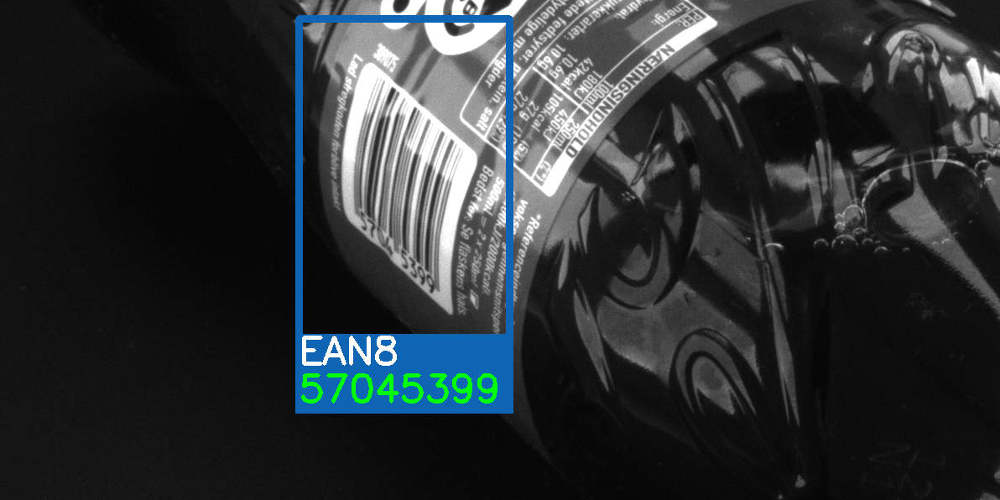

CodeMAX-Barcode-Reader-SDK
==================
**Real-Time Barcode Decoding With World-Class Performance**

Introduction
----------------
Sension's [CodeMAX Barcode Reader SDK](https://www.sensionweb.com/codemax-sdk) enables world-class barcode decoding performance with just a few lines of code. Unlike the majority of commercially available barcode decoders, the CodeMAX Barcode Reader SDK requires no complicated configuration or parameter finetuning. The CodeMAX Barcode Reader is available as a library for Ubuntu Linux 16.04 and Microsoft Windows 10 (coming soon).

Download Free 30-Day Demo
-------------
[https://www.sensionweb.com/codemax-sdk/codemax-demo-sdk](https://www.sensionweb.com/codemax-sdk/codemax-demo-sdk) 

Online Barcode Reader
------------------------------
It is also possible to try out the robust and reliable barcode decoding performance of the CodeMAX Barcode Reader SDK by using our [free online barcode reader](https://www.sensionweb.com/online-barcode-reader/) which is based on the SDK.

Specifications
------------------
### Product Features
* Barcode reader software with plug-and-play functionality
* Decodes highly deformed, and degraded low-quality barcodes
* Decodes symbols on glossy, wrinkled and uneven surfaces
* Decodes highly scratched, scuffed and damaged symbols
* Decodes 2D barcodes with damaged alignment or clock pattern
* SenseMAX technology for reading of small symbols with module sizes below 2 pixels
* Real-time performance using advanced GPU acceleration.
* Simple integration that requires only very few lines of code
* Minimum of technical skills required
* Simple text string output in standard XML format
* Additional result image for visualization
* Support multiple image formats including png, bmp and jpeg formats
* Example codes and open source demo projects
* Excellent for real-time scanner applications 
* Possible user configuration
* C/C++ programming language

### Supported Symbologies
* 1D Barcodes: UPC-A, UPC-E, EAN-8, EAN-13, EAN-128, Code 39, Code 93, Databar composite CC-A and CC-B, GS1-128, ITF, Codabar, MSI Plessey, Databar limited, stacked omnidirectional and truncated.
* 2D Barcodes: QR code (and Micro-QR), Datamatrix, Databar, PDF 417 (and Micro PDF 417)

### Barcode Result Output
* Barcode type
* Barcode content
* Barcode symbol bounding box coordinates
* Barcode processing time
* Image with barcode information overlay graphics

### Supported Image Sources
* Color or grayscale jpg, jpeg, png, tif, tiff, bmp images
* 8 or 24-bit image buffer

### Supported Operating systems
* Linux Ubuntu 16.04
* Windows 10 (Coming soon)

### Supported Languages
* C++
* C# (Coming soon)

### Example
To see how easy it is to integrate world-class barcode reading performance into your application please refer to the [CodeMAX Barcode Reader SDK C++ Example](example/codemax-example.cpp)

